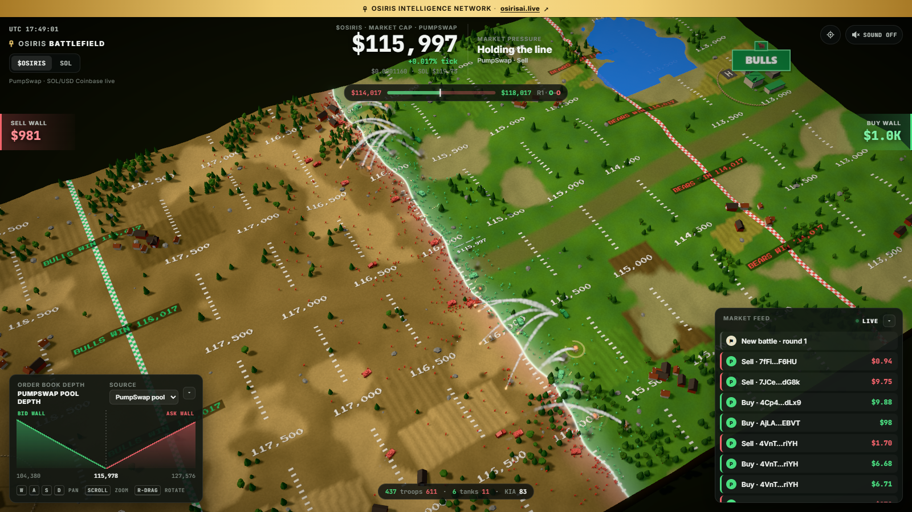
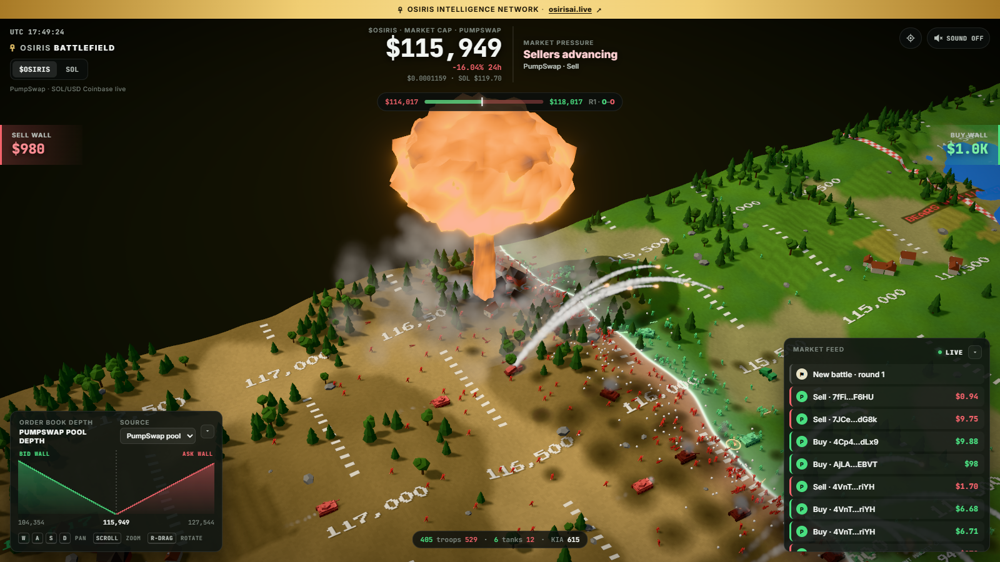
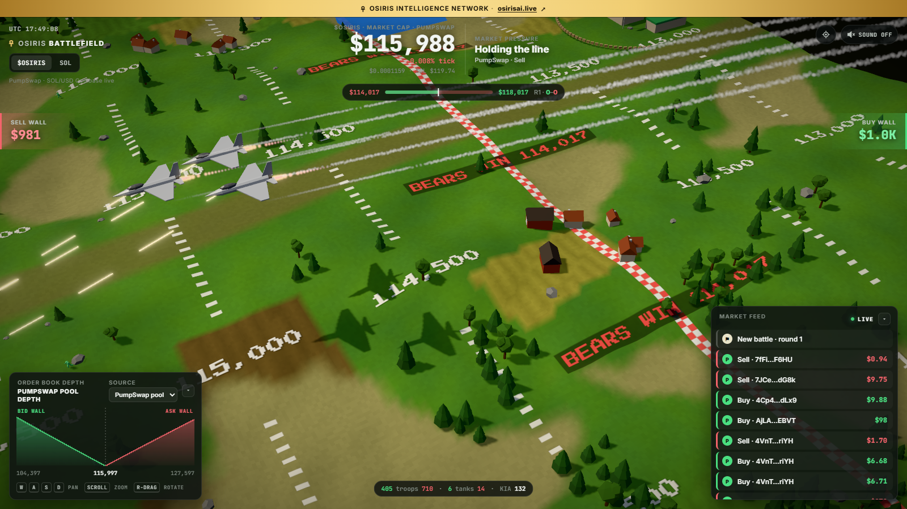
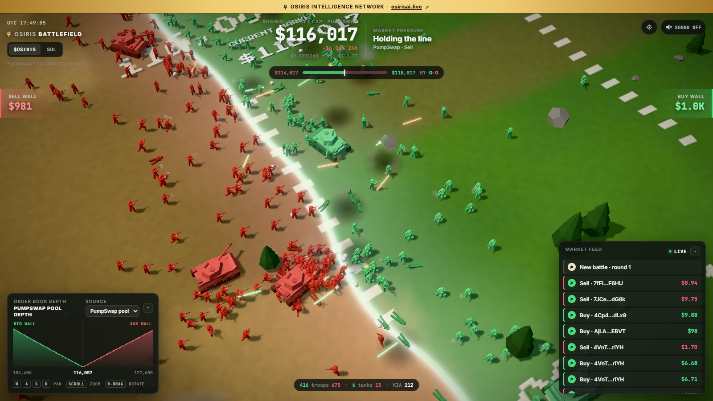
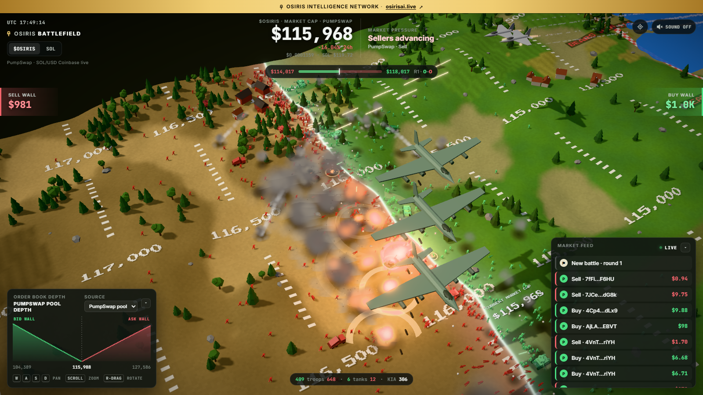
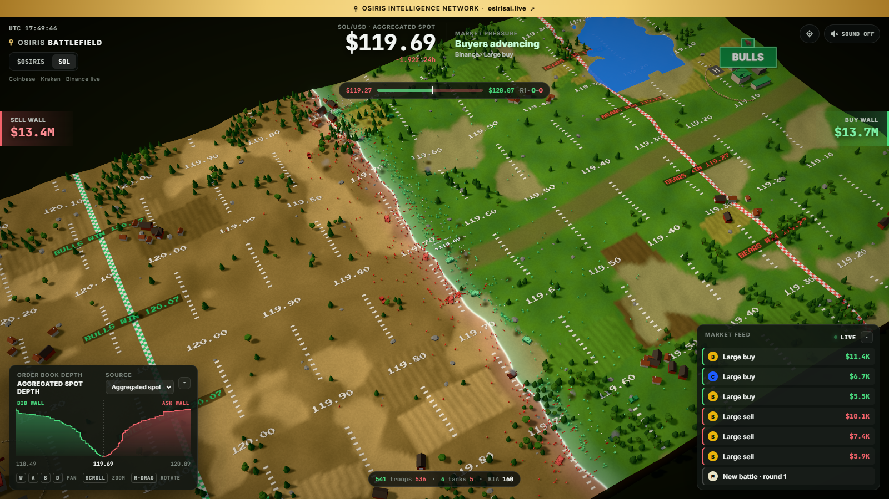
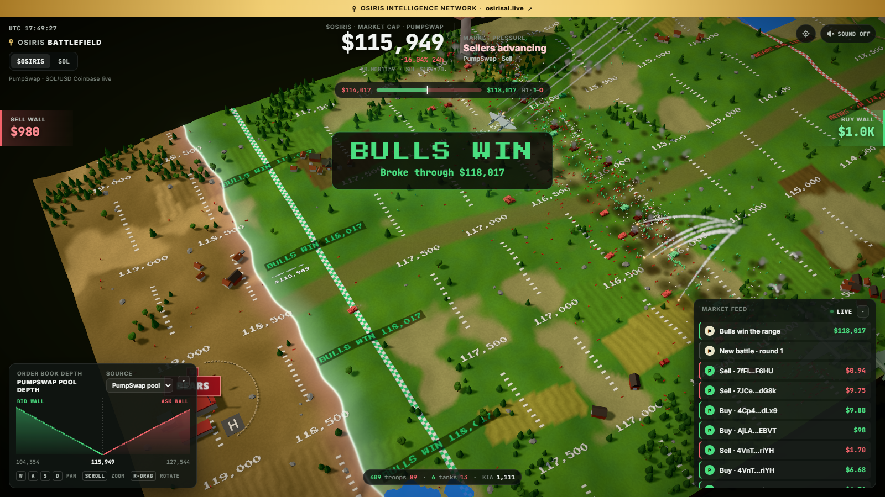

<div align="center">

# ☥ OSIRIS Battlefield

### [osirisai.live ↗](https://www.osirisai.live/)

**The live $OSIRIS and SOL markets as a real-time 3D war.**

The front line sits on the live price. Depth and the trade tape field the armies. Every whale buy and sell calls in air power: helicopters, jet gun runs, bombing runs, and for the biggest orders a tiny nuke with a mushroom cloud.

[](https://kit.svelte.dev)
[](https://threejs.org)
[](https://solana.com)



</div>

---

## How it works

Modelled on the viral Bitcoin Battlefield: a price chart turned into a diorama war between **Bulls** (buyers, green) and **Bears** (sellers, red).

- **The terrain is a price ladder.** Marker rows are painted across the field at a fixed dollar spacing. For $OSIRIS that is about 0.4% of market cap, rounded to a clean step (e.g. every $500). The **front line is drawn exactly on the live value**, between the right two rows, with a **CURRENT MARKET CAP** label beside it.
- **Price up, the Bulls advance** toward the Bear base; price down, the Bears push toward the Bull base. Soldiers caught on the wrong side of a moving line run for it, or fall.
- **Every round is a price range.** A battle opens four marker rows either side of the price at the start. Push through the end zone by the enemy's base and you win the range: victory banner, the beaten army routs, the winners' bombers hit the line, then the field resets around the latest price and the next battle begins.
- **Liquidity buffers.** The shaded bands either side of the front come from book depth: a bigger buy wall widens the Bulls' buffer, a bigger sell wall the Bears'.

### Why the $OSIRIS line moves every second

$OSIRIS trades against SOL in a PumpSwap constant-product pool, so its USD market cap is **pool price in SOL × live SOL/USD × supply**. SOL/USD streams tick by tick from Coinbase (Kraken as fallback), which keeps the front alive between $OSIRIS trades, exactly as the real USD value moves. When an $OSIRIS trade lands, the pool is stepped along *x·y = k* on the spot, so the line jumps on the print instead of waiting for the next indexer refresh.

## Forces

| On the field | What it represents | $OSIRIS trigger | SOL trigger |
| --- | --- | --- | --- |
| 🪖 **Infantry** | Broad participation near the front | Army split from pool depth + last-hour buy/sell flow; **every trade sends a squad** | Book walls ±1% + 60s taker flow; orders ≥ $2K send a squad |
| 🛡 **Tanks** | Heavier pressure | Trades ≥ 0.08% of pool liquidity | Orders ≥ $15K |
| 🚀 **Rocket launchers** | Artillery behind the line, firing salvos as volatility rises | Volatility (1h change + SOL range) | 60s price range; liquidations ≥ $3K fire a barrage |
| 🚁 **Helicopter strike** | Chin-gun burst, then a rocket ripple from a hover | Trade ≥ 0.15% of liquidity | Order or liquidation ≥ $20K |
| ✈️ **Jet strike** | Afterburning jets strafe the line with cannon, then fire missiles and pull up | Trade ≥ 0.5% of liquidity | ≥ $50K |
| 💣 **Bombing run** | Bomber formation carpet-bombs the line under a fighter escort | Trade ≥ 1.5% of liquidity | ≥ $120K |
| ☢️ **Tactical nuke** | Siren, a white-hot warhead from the sky, flash, mushroom cloud, base surge | Trade ≥ 4% of liquidity | ≥ $400K |

A buy (or a liquidated short) is flown by the Bulls against the Bears; a sell (or a liquidated long) by the Bears against the Bulls. On SOL, an "order" is one venue's taker prints summed per side over a second, since a big market order fills as a spray of small prints. The $OSIRIS tiers scale with pool liquidity, so a whale stays a whale as the pool grows. Explosions, smoke, craters and camera shake all scale with the size of the event.









## Two theaters

**$OSIRIS** is the default. Switch to **SOL** in the top-left (or open `/?m=sol`) for the full order-book version on Solana: aggregated **Coinbase + Kraken + Binance** SOL spot books, with a source picker for each venue, plus the tape and SOL perp liquidations from Binance, Bybit and OKX. It all streams over public WebSockets straight from the browser, with a REST price fallback on networks that block them.



## The HUD

- **Price**, tick change, and 24h change, with the source it comes from.
- **Market pressure:** *Buyers advancing*, *Sellers advancing* or *Holding the line*, plus the last meaningful event.
- **Sell wall / Buy wall:** liquidity within the band (±10% of market cap for the $OSIRIS pool, ±1% for the SOL books).
- **Order book depth chart**, cumulative bids vs asks.
- **Market feed:** trades (click through to Solscan for $OSIRIS), liquidations, air strikes, nukes, new battles and victories.
- **☢ NUKE INBOUND** alert when a warhead is on its way, and a white-out on detonation.
- The gold bar across the top links to [osirisai.live](https://www.osirisai.live/).
- **Round bar:** the current range, where the front sits inside it, and the Bulls–Bears score.



## Controls

| Input | Action |
| --- | --- |
| `W A S D` / arrows, or drag | Pan |
| Scroll / pinch | Zoom (toward the cursor) |
| Right-drag, `Q` / `E` | Rotate |
| ⌖ button | Recenter on the front |
| 🔊 button | Sound (off by default; fully synthesized WebAudio) |

Leave the camera alone for about 15 seconds and it drifts back to follow the front line.

## Quick start

```bash
npm install
cp .env.example .env   # defaults work out of the box
npm run dev            # → http://localhost:5175
```

## Configuration (`.env`)

| Variable | Default | Purpose |
| --- | --- | --- |
| `OSIRIS_TOKEN_MINT` | `2nZN…pump` | $OSIRIS SPL mint (supply, market data) |
| `OSIRIS_POOL_ADDRESS` | `G3rc…b4ce` | The PumpSwap pool (trade tape, reserves) |

## Architecture

```
src/
├── lib/
│   ├── battle/
│   │   ├── engine.ts    # renderer + post (bloom, tone map, vignette), rounds,
│   │   │                #   price → front line, forces → army sizes, HUD stats
│   │   ├── world.ts     # height field, ground shader (territory tint, buffers,
│   │   │                #   front line), painted price ladder, craters, road, lakes
│   │   ├── army.ts      # instanced infantry (3 poses/side), tanks, rocket trucks,
│   │   │                #   firefights with lethal tracers, blasts, skulls
│   │   ├── air.ts       # helicopter / jet / bomber strikes, nuke delivery
│   │   ├── nuke.ts      # mushroom cloud: noise-displaced, shader-lit cap, stem, surge
│   │   ├── fx.ts        # billboard particles, tracers, shockwaves, ordnance
│   │   ├── models.ts    # procedural low-poly toy soldiers, armour, aircraft, scenery
│   │   ├── scenery.ts   # forests, villages, HQ compounds and signs
│   │   ├── camera.ts    # map camera (pan / zoom-to-cursor / rotate / follow / shake)
│   │   └── audio.ts     # synthesized battle audio
│   ├── market/
│   │   ├── osiris.ts    # PumpSwap pool × live SOL/USD, x·y=k depth, trade tape
│   │   ├── sol.ts       # SOL: Coinbase/Kraken/Binance books, whale bursts, liquidations
│   │   └── theaters.ts  # how each market maps onto the field
│   └── server/osiris.ts # mint + pool config
└── routes/
    ├── +page.svelte     # canvas + HUD
    └── api/
        ├── trades/      # $OSIRIS trade tape (GeckoTerminal, proxied + cached)
        └── pool/        # pool price, reserves, supply (DexScreener, proxied + cached)
```

No model or texture files: every soldier, vehicle, tree and building is built procedurally at load.

## Disclaimer

A live market visualization for entertainment, not a prediction tool and not financial advice. Walls move, disappear or get filled in real time.

---

<div align="center">

**OSIRIS INTELLIGENCE NETWORK** · [osirisai.live](https://www.osirisai.live/)

</div>
